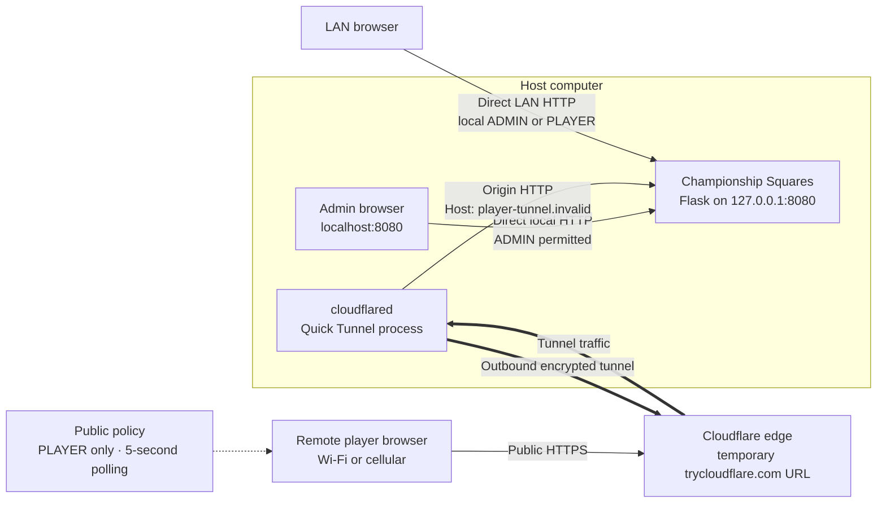

# Cloudflare Quick Tunnel

Championship Squares uses a Cloudflare Quick Tunnel to let remote players reach a
game running on the host computer. The tunnel is optional: local play continues to
work over `localhost` and the LAN without Cloudflare.

This is an ephemeral Quick Tunnel, not a named Cloudflare Tunnel. It does not need a
Cloudflare account, DNS record, router port-forward, or inbound firewall rule. The
host only needs the `cloudflared` executable and outbound Internet access.

## Connectivity



The remote browser connects to Cloudflare over HTTPS. Cloudflare carries the request
through the outbound tunnel to `cloudflared` on the host, which forwards it to the
Flask application over loopback HTTP. The Flask server is not opened directly to the
Internet. Responses return along the same path.

## Install `cloudflared`

`cloudflared` must be available on the host's `PATH`. It is not required for LAN-only
games.

Ubuntu or Debian:

```bash
sudo mkdir -p --mode=0755 /usr/share/keyrings
curl -fsSL https://pkg.cloudflare.com/cloudflare-main.gpg | sudo tee /usr/share/keyrings/cloudflare-main.gpg >/dev/null
echo "deb [signed-by=/usr/share/keyrings/cloudflare-main.gpg] https://pkg.cloudflare.com/cloudflared any main" | sudo tee /etc/apt/sources.list.d/cloudflared.list
sudo apt-get update
sudo apt-get install cloudflared
```

macOS with Homebrew:

```bash
brew install cloudflared
```

For Windows and other Linux distributions, follow the
[official cloudflared installation instructions](https://developers.cloudflare.com/cloudflare-one/networks/connectors/cloudflare-tunnel/downloads/).

Confirm the executable is available:

```bash
cloudflared --version
```

## Start remote access

1. Start Championship Squares and open `http://localhost:8080` on the host.
2. Enter **ADMIN** mode and select both teams.
3. Open **QR CODE**.
4. Select **ENABLE TUNNEL**.
5. Wait for the status to change from **TUNNEL OFF** to **TUNNEL ON**.
6. Choose one of the player QR options described below.

The application starts this process internally:

```text
cloudflared tunnel --url http://127.0.0.1:8080 --http-host-header player-tunnel.invalid
```

`cloudflared` creates a random HTTPS address such as
`https://example-words.trycloudflare.com`. The application reads that address from
the process output, validates that it is a `trycloudflare.com` URL, and uses it when
building player QR codes. Tunnel startup fails after about 20 seconds if no valid URL
is received.

Only one Quick Tunnel process is owned by the application at a time. Selecting
**DISABLE TUNNEL**, stopping the server, or exiting the application terminates that
process and clears the active public URL.

## Player QR types

### New-player registration

**CREATE PLAYER QR** produces a URL with this shape:

```text
https://<temporary-host>.trycloudflare.com/join/register/<registration-token>
```

The player scans it, enters an ID and name, and is signed into that player session.
Both teams must be selected before the application will issue this QR code.

The registration token exists only in memory. It is replaced when a tunnel starts
and when the game is reset. It is cleared when the tunnel stops.

### Existing-player rejoin

Select a player and choose **SHOW PLAYER QR** to produce a URL with this shape:

```text
https://<temporary-host>.trycloudflare.com/join/<player-id>/<signed-token>
```

The signed token binds the link to that player. Scanning it signs the browser into
that player's session and opens the board. **RESET PLAYER LINK** revokes the old link
for future joins and creates a new one. A browser that already redeemed the old link
remains signed in until its session becomes invalid.

Deleting the player or resetting the game revokes the link. The signing key is loaded
from `.flask-secret` (or the configured environment/file setting), so the signed
token remains valid across application restarts when the public hostname is
unchanged. Replacing the signing key invalidates it.

A restarted Quick Tunnel normally receives a different public hostname. The token
may still be valid, but the old hostname no longer routes to this application. When
the application detects a changed hostname, the QR dialog displays **NEW ADDRESS ·
RESHARE PLAYER LINKS**.

## Trust boundary and security

Admin access remains local even while the tunnel is enabled:

- Tunnel controls and player-link creation require a local ADMIN session.
- Public requests cannot log into ADMIN mode or use admin-only endpoints.
- `cloudflared` forwards origin requests with the fixed host
  `player-tunnel.invalid` over loopback. Both conditions must match before the
  application treats a request as public ingress; a spoofed Host is rejected.
- Public game-state endpoints require a valid PLAYER session. Forwarded client
  addresses are trusted only on verified tunnel-origin requests.
- Non-GET requests require the session's `X-CSRF-Token`; the browser adds it
  automatically and the application checks the request origin when supplied.
- Public session cookies are `Secure`, `HttpOnly`, and `SameSite=Lax`.
- The signing key stays in a protected local file or environment setting; it is
  never stored in SQLite, logs, QR/API responses, or source control.
- Requests are size- and rate-limited, and responses use a restrictive browser
  security policy. Excess traffic receives HTTP 429 with `Retry-After`.
- Invite tokens are redacted from Werkzeug request logs. QR and invite responses use
  `Cache-Control: no-store`.
- Remote browsers use five-second state polling. Local browsers use server-sent
  events for near-instant updates.

Player QR URLs are bearer links: anyone who receives a valid link can enter as that
player. Send each existing-player QR only to its intended player, reset a link if it
was shared accidentally, and disable the tunnel when remote access is no longer
needed.

## What changes when the tunnel stops

When **DISABLE TUNNEL** is selected:

- the `cloudflared` child process is terminated;
- the temporary public URL stops working;
- the in-memory registration token is cleared;
- local host and LAN access continue normally; and
- existing remote pages can no longer reach the game.

Starting the tunnel again creates a new `trycloudflare.com` hostname. The application
remembers the prior non-secret URL in `game_state.db` and warns the local admin when
it changes. Display and share each player's QR code again; resetting or recreating
the player is unnecessary because the existing invite key is reused.

Quick Tunnels cannot provide durable URLs. Games that require one public URL across
tunnel restarts need deployment support for a named Cloudflare Tunnel or another
stable public hostname, configured with the same protected signing key and
equivalent origin safeguards. The built-in **ENABLE TUNNEL** control starts only a
Quick Tunnel.

## Troubleshooting

### `INSTALL CLOUDFLARED FIRST`

The application could not find `cloudflared` on `PATH`. Install it, confirm
`cloudflared --version` works in the same environment that launches the game, and
restart Championship Squares.

### `TUNNEL FAILED — TRY AGAIN`

The child process exited or did not provide a valid Quick Tunnel URL within the
startup window. Check outbound Internet connectivity, DNS, firewall or VPN policy,
and run `cloudflared --version` to confirm the installation.

### `SET TEAMS FIRST`

Select both teams in ADMIN mode. Public self-registration is intentionally disabled
until the game has an away and home team.

### A previously scanned QR no longer works

Quick Tunnel hostnames are temporary. The tunnel may have been disabled or restarted,
the server may have restarted, the game may have been reset, or the player's link may
have been reset or deleted. Generate a fresh QR code from the local ADMIN session.

## Testing

The normal automated suite simulates public tunnel ingress and does not expose the
live game. A real disposable-tunnel smoke test is opt-in:

```bash
SQUARES_REAL_TUNNEL_TESTS=1 python -m pytest -q tests/test_live_tunnel.py
```

This test requires `cloudflared`, working public DNS and Internet connectivity. It
briefly creates a public Quick Tunnel, verifies player access and ADMIN rejection,
and shuts the tunnel down during cleanup. See [TESTING.md](TESTING.md) for the full
test procedure and [API_DOCUMENTATION.md](API_DOCUMENTATION.md) for endpoint details.
