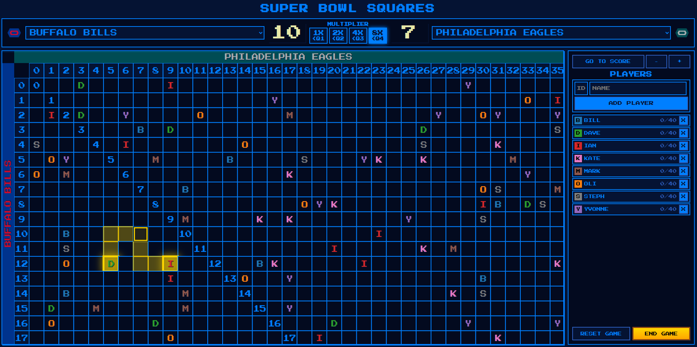
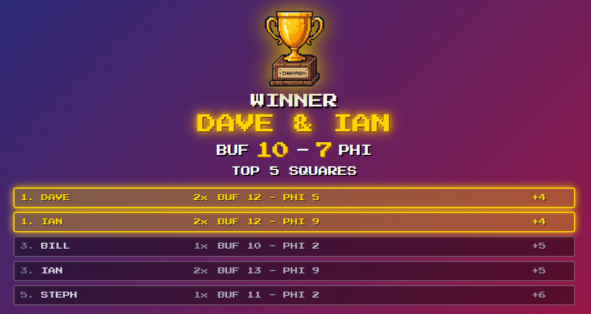

# CHAMPIONSHIP SQUARES

Small web app to run a Championship Squares game. Works on Linux, macOS, and Windows.

## Gameplay

Championship Squares is a sports-pool game where players use their available tokens to place bets on squares representing predicted final scores. Each row represents the away team's score, and each column represents the home team's score.

The multiplier follows the game's stages: **1x before the game**, **2x before the second quarter**, **4x during halftime before the third quarter**, and **8x before the fourth quarter**. Other sports follow a similar progression around their periods, halves, or innings. Each new bet costs the current multiplier in tokens, so a square placed at 4x costs four tokens.

Update the scores manually as points are scored during the game. At the end, the player with the eligible square closest to the final score wins. Only squares that predict the winning team qualify; closeness is the sum of the differences between the predicted and actual scores for both teams. Equally close squares share the win.



## Login modes

Choose **ADMIN** for the New Game / Load Game menu and full control of the game.
Choose **PLAYER** to select an existing player or create one and join the current game.
Players can tap an empty square to place their own token and tap their own square to
remove it. Teams, scores, multipliers, game resets, and player management are admin-only.
Use **Change mode** to sign out and select another mode. Player sessions must reselect
their player if the admin deletes that player, resets the game, or restarts the server.

Mode selection does not require a password: anyone can choose ADMIN or an existing
player. Permissions apply to the selected session and are enforced by the server.
API clients must POST `/api/login` with `{"role": "admin"}` or
`{"role": "player", "initial": "A"}` and retain the session cookie before modifying a game.

## Quick start

Clone the repository:

```bash
git clone https://github.com/bilbilivo/championship-squares.git
cd championship-squares
```

On Ubuntu or Debian, install the Python venv support first:

```bash
sudo apt install python3-venv
```

If you are on a very minimal Python install and `python3 -m venv` still complains about missing
`ensurepip`, install:

```bash
sudo apt install python3-full
```

Then start the app:

```bash
./start_server.sh start
```

On first run, the launcher will:

- create a project-local virtual environment in `./venv`
- install the app and its Python dependencies into that virtual environment
- create a desktop shortcut
- start the server and open `http://localhost:8080`

You do not need to run `pip install` system-wide for this project. The launcher is designed to use
its own virtual environment.

## Requirements

- Python 3.10 or later
- Bash on Unix-like systems
- PowerShell on Windows
- A web browser with JavaScript enabled

## Running the app

Unix and macOS:

```bash
./start_server.sh start
./start_server.sh status
./start_server.sh stop
./start_server.sh restart
```

Windows PowerShell:

```powershell
powershell -ExecutionPolicy Bypass -File .\start_server.ps1 start
powershell -ExecutionPolicy Bypass -File .\start_server.ps1 status
powershell -ExecutionPolicy Bypass -File .\start_server.ps1 stop
powershell -ExecutionPolicy Bypass -File .\start_server.ps1 restart
```

The app opens `http://localhost:8080` in your default browser automatically on start.

Click **QR CODE** in the top-right corner to show a scannable game link. Connect
other devices to the same Wi-Fi or local network and scan with their camera.
When opened through localhost, the app detects the host PC's network address
(for example, `http://192.168.1.175:8080/`). The QR code is generated locally.

## Remote player links (free)

For an occasional remote game, install [cloudflared](https://developers.cloudflare.com/cloudflare-one/networks/connectors/cloudflare-tunnel/downloads/)
on the host laptop. Open **QR CODE** as ADMIN and select **ENABLE TUNNEL**. The QR code
then contains a temporary public URL. Use **CREATE PLAYER QR** for phone-based
self-registration, or select an existing player and choose **SHOW PLAYER QR** to
display that player's rejoin code. The host and trusted LAN devices keep Admin control locally; tunnel
visitors can only create or join a player. Turn the tunnel off when the game ends.

Quick Tunnel links are temporary and do not provide instant update events, so remote
phones use explicit five-second polling. Local devices retain instant updates.

ADMIN mode is passwordless on the trusted LAN. Public connections cannot enter ADMIN
mode or use admin controls, even with an existing admin session. Player links grant
access to one player: share them only with that player. Resetting a player link
revokes the old link for future joins; active player sessions stay signed in.
Game reset also expires the registration QR. Tunnel restarts change the public URL;
server restarts invalidate sessions and require fresh QR links.

API mutations require an `X-CSRF-Token` obtained from `/api/csrf` using the same
session cookie. Browser requests handle this automatically.

See [CLOUDFLARE.md](CLOUDFLARE.md) for the connectivity diagram, complete setup,
security model, link lifecycle, and troubleshooting guide.

### Install cloudflared (optional)

`cloudflared` is only needed for remote player links; it is not needed to run the
game on your local network.

On Ubuntu or Debian, add Cloudflare's package repository, then install it:

```bash
sudo mkdir -p --mode=0755 /usr/share/keyrings
curl -fsSL https://pkg.cloudflare.com/cloudflare-main.gpg | sudo tee /usr/share/keyrings/cloudflare-main.gpg >/dev/null
echo "deb [signed-by=/usr/share/keyrings/cloudflare-main.gpg] https://pkg.cloudflare.com/cloudflared any main" | sudo tee /etc/apt/sources.list.d/cloudflared.list
sudo apt-get update && sudo apt-get install cloudflared
```

On macOS with Homebrew:

```bash
brew install cloudflared
```

For Windows and other Linux distributions, use Cloudflare's
[cloudflared download instructions](https://developers.cloudflare.com/cloudflare-one/networks/connectors/cloudflare-tunnel/downloads/).

## Lite mode

Use `--lite` to reduce visual effects on slower hardware. Use `--no-lite` to switch back.
End-game fireworks start automatically and run until the celebration closes,
including in lite mode and when the browser reports reduced motion. Other effects
continue to respect those settings.
The setting is persisted across restarts.

```bash
./start_server.sh --lite start
./start_server.sh restart
./start_server.sh --no-lite restart
```

## If setup was interrupted

If you previously ended up with a partial or broken `venv`, the launcher should repair it
automatically. If you still want to reset it manually, remove it and start again:

```bash
rm -rf venv
./start_server.sh start
```

This is the safest fix for errors such as:

- `ModuleNotFoundError: No module named 'flask'`
- `externally-managed-environment`

Those errors usually mean the launcher was not using the project virtual environment correctly, or
that an earlier setup attempt left the virtual environment incomplete.

## Visual design guideline

Keep on-screen text minimal, like retro video games. Prefer short labels and brief prompts. Remove redundant instructions while keeping essential action details.

Prioritize **more content, less empty space** while preserving the retro look. Use compact player rows, modest gaps and padding, and responsive layouts that make full use of the screen. Keep text readable and touch controls easy to use; avoid decorative whitespace that reduces room for the board or players.

## Board navigation

- The board starts with readable square cells. Drag to pan, scroll or pinch to zoom, or use the **− / +** buttons.
- Zoom out as far as the full-board scale. The board stays flush with the top and left score axes; unused space remains on the right or bottom. Selecting a cell smaller than 24px zooms in before allowing a claim.
- **Go to score** brings the current score into view at a readable size.
- Player rows show an initial badge, name, and remaining/total allocation, such as **40/40**.
- With the board focused, use arrow keys to pan and **+ / −** to zoom.
- On smaller screens, scroll to the player controls and use **Players** to collapse or expand the panel.

The layout adapts to the available window space while keeping the retro theme. System reduced-motion preferences are respected alongside the existing lite mode.

## Desktop shortcut

The `install` action creates a desktop shortcut for one-click launching.

Unix and macOS:

```bash
./start_server.sh install
./start_server.sh uninstall
```

On Linux, this creates a `.desktop` file in the project folder and installs it to
`~/.local/share/applications` so the app appears in your Applications menu. The launcher also runs
`install` automatically on first run.

Windows:

```powershell
powershell -ExecutionPolicy Bypass -File .\start_server.ps1 install
powershell -ExecutionPolicy Bypass -File .\start_server.ps1 uninstall
```

`uninstall` removes the shortcut. It does not remove the virtual environment or game data.

## Files of interest

- `app.py` - main application
- `config.py` - platform-aware configuration
- `start_server.sh` - Unix and macOS launcher
- `start_server.ps1` - Windows launcher
- `pyproject.toml` - project metadata and dependencies

## More documentation

- `API_DOCUMENTATION.md`
- `CONFIGURATION.md`
- `DEPLOYMENT.md`
- `TESTING.md`
- `TROUBLESHOOTING.md`

## End Game


## License

MIT

## Trademark notice

Team names, league names, and related trademarks are the property of their respective owners.
This project is not affiliated with or endorsed by any professional sports league or team.

## Support

If you find this project useful, consider supporting it:

[](https://paypal.me/bilbilivo)

## Contributing

Contributions welcome. Please open issues or submit pull requests.

Player self-registration requires both teams to be selected by ADMIN first.
